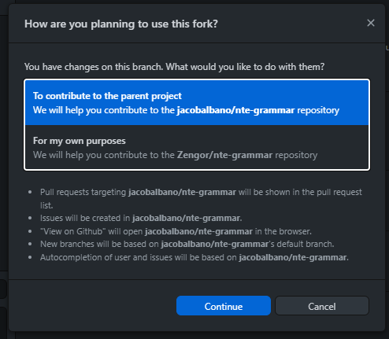
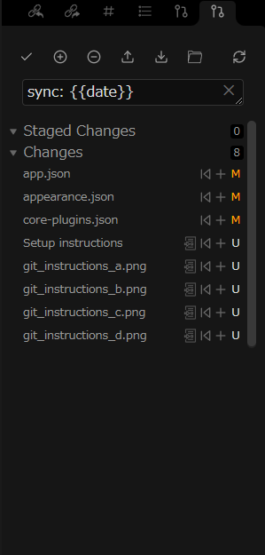
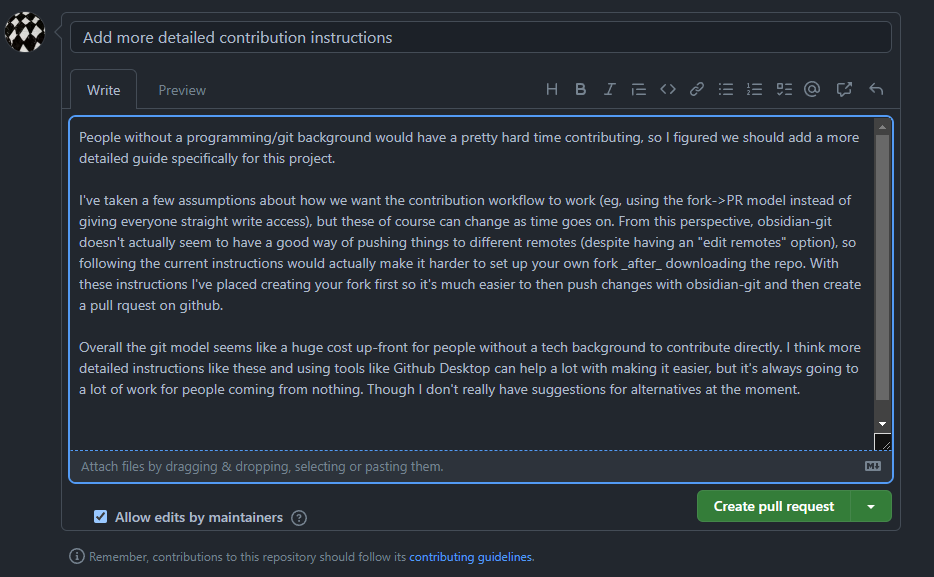

# Git usage and workflow
This is a step-by-step guide to setting up a way to contribute for people who are not very familiar with git. Some of this stuff is pretty complicated; if something isn't clear feel free to ask.

### Initial setup
- Make a Github account. (If you are on github, there should be a signup button up there)
- Install git on your local computer
	- Go to https://git-scm.com/downloads and choose your OS for a download link.
	- Instal [Github Desktop](https://desktop.github.com). This isn't strictly necessary but is gonna help with later steps. Once you install it, open it so you can log in.
- Install [Obsidian](https://obsidian.md) if you haven't already.
	- You can technically edit these files with any text editor, but this repository is intended to be used with Obsidian.
	- Obsidian is a pretty deep application with lots of cool features. If you're interested or confused you can try looking at the official [Obsidian documentation](https://help.obsidian.md/Obsidian/Index).
	- In particular, see [this page](https://help.obsidian.md/How+to/Format+your+notes) for how to format text in Obsidian.
- Create a fork.
	- A fork is a copy of this repository, but associated with your account, which means you can do anything you want to it.
	- On the github page, if you're logged in, there should be a button up near the top. 
	- This button will take you to a new page, you can just click on the green "Create fork" button at the end.
- Now we download the repository. There are other ways of doing it but here's what I recommend for simplicity.
	- On Github Desktop, you should be able to see your fork on a list of your repositories. 
	  
	- Click the "Clone {your username}/nte-grammar" button down below.
	- This opens up a dialog where you can change a few things, such as where the folder will go, if you prefer. Then click the blue button to move on.
	- Next you should see this pop up. Make sure to keep "contribute to the parent project" before clicking Continue.
	  
- Open up Obsidian.
	- Click "Open" and choose the same folder you set up with Github Desktop. 
	- The first time you open the vault Obsidian will ask you to trust plugins. This is not mandatory but will help automate some of the tasks involved in syncing. 
		- Currently we have these plugins associated with the vault:
			- [Obsidian-git](https://github.com/denolehov/obsidian-git)

Now you have a full local copy and can make changes as you please. 

### Submitting changes
Your local changes aren't automatically uploaded either to your local fork or submitted to the parent repository. Here's how to do that using the installed obsidian-git plugin. Certain parts here can be automated through plugin settings. Note also that most of the stuff we're using obsidian-git for here can be done through Github Desktop, if you find that interface more approachable.

After you have some changes, open the command palette (pressing **Ctrl-P**, or **Cmd-P** on Mac and type "source control view," then press Enter. A panel like this should open to the right. 
  

The buttons on the source control panel are the main controls for interacting with the repositiory. They include some git lingo, so here's a run-down of the lingo and what some buttons do.
- **Staged Changes**: These are the files you want to include in the sync.
- **Changes**: The files which you've changed which have not been staged yet.
	- Each file has a **+** button to the right of its name which you can click to stage that specific file. This means you have control over which files you want to submit and which you're still working on.
- **Commit** (the ✔ button up top): This creates a "snapshot" of all your staged changes so they can be uploaded.
	- The textbox (which by default says `sync: {{date}}`) is the _commit message_ (basically what you call the commit). You can change it to a short description of the change if you'd like.
- **Stage All** (the circled **+** up top): This stages everything. So all files in "changes" move to "staged changes".
- **Unstaged changes** (the circled **-** up top): A way to say "oh no go back" and move everything back down to "Changes." This is useful if you accidentally stage everything but would rather do just one or two files instead.
- **Push** (the ↑ button up top): Uploads _committed_ changes to your fork. This means that things in "staged changes" and "comitted changes" don't really get submitted, you need to stage _then_ commit.
- **Pull** (the ↓ button up top): This is how you get remote changes into your local repository. (this might not be working 100% right now, we're still looking into how obisdian-git interacts with forks, but we can talk about how to use github desktop to do this later.)

So the basic workflow when you've made changes is to stage them, then press commit, then press "push". Pushing is the only thing which actually _uploads_ changes. That means that if you learn more advanced usages of git you can for example _revert_ committed changes if you need to. But let's not worry about that right now.

So for now let's:
- Stage all
- Commit
- Push

When you click push, the little sync icon to the right should spin for a bit while it's uploading. If everything is okay it'll just stop spinning with no errors popping up.

Now you've uploaded changes, but specifically _to your fork._ They haven't yet been submitted to the parent repository. We need to open what's called a **pull request**. This is like asking "hey can you take a look at my changes, and if they're good, add them to the main repo?"

To open a pull request after you've pushed changes to your fork these are the two easiest ways:
- On Gihub Desktop, press **Ctrl-R/Cmd-R** (or, click on Branch > Create Pull Request on the menu.) 
	- This should open your browser with a page showing you all the changes you made. Just click on the green "Create pull request." button to go to the actual pull request creation interface.
- On the page for your fork on github, there's a little indication of how different your fork is from the parent repo.
	- Here you can click on "Contribute" and then "Open pull request."

Once you do either of the above, you should be at a page like this:

Here you can change the title and write a description. Giving your pull request a good title and description can help everyone understand what it is you're trying to do, and make better comments on the changes. For example: 

Once you're done, click "Create pull request." (You can also click the little arrow to the right and choose to make a _draft_ pull request, if you want to signal that you aren't done but just want people to be able to see what you're working on).

Now your changes are fully submitted. People can see what you've made and then make comments and suggestions on your changes. If everything is ok, your pull request can be accepted and then merged with the parent repo.

If there are suggestions (or if you just forgot something), you can still make more changes with the same process as before: make the change, stage it, commit it, then push. This will automatically reflect in your pull request.

There are more advanced things you can do if you want to if you learn more about git works. For example, you can even make two completely pull requests which can be reviewed and edited separately. For that we would use something called _branches,_ but it's a bit out of the scope of this guide. The above submission process should be good enough for most situations.

### Syncing changes
When something changes in the parent repo (sometimes called upstream), your fork needs to pull those changes before they are reflected on your local files. This is a bit clunkier than we'd like at the moment but the easiest way is to go to your fork's page on github.

This UI element we saw before can also tell us how behind our fork is compared to upstream. From here you can just click "Sync fork," then "Update branch" to get everything synced up.

Once this is done, back in obsidian when you press the "Pull" button, the changes will be reflected on your local files.